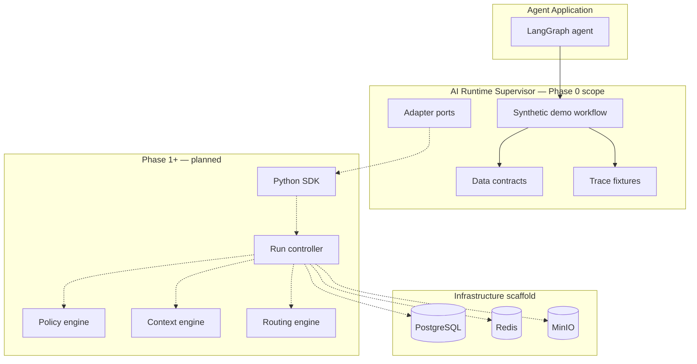
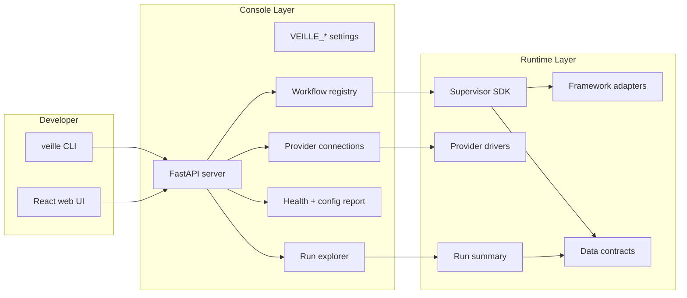

# Architecture

## Overview

The AI Runtime Supervisor is a **control plane** that sits between agent applications and model/tool providers. It does not replace agent frameworks, gateways, or observability platforms—it integrates with them.

## Phase 0 components

| Component | Path | Status |
|---|---|---|
| Task contract models | `src/supervisor/contracts/task.py` | Implemented (v0.1) |
| Run event models | `src/supervisor/contracts/events.py` | Implemented (v0.1) |
| Execution plan skeleton | `src/supervisor/contracts/plan.py` | Schema only |
| Policy definition skeleton | `src/supervisor/contracts/policy.py` | Schema only |
| Validation report | `src/supervisor/contracts/validation.py` | Implemented (v0.1) |
| LiteLLM mock adapter | `src/supervisor/adapters/litellm/mock.py` | Implemented |
| Demo workflow | `examples/cited_market_research/` | Implemented |
| Trace fixtures | `fixtures/traces/` | Implemented |

## Phase 1 components (Observe and explain)

| Component | Path | Status |
|---|---|---|
| Python SDK (`Supervisor` + `RunCollector`) | `src/supervisor/sdk/` | Implemented (v0.1) |
| LangGraph adapter (callback-based) | `src/supervisor/adapters/langgraph/adapter.py` | Implemented |
| Run summary analytics | `src/supervisor/analytics/run_summary.py` | Implemented |
| Observe-only policy engine | `src/supervisor/policy/engine.py` | Implemented (observe mode) |
| OTel exporter (Console + OTLP) | `src/supervisor/telemetry/exporter.py` | Implemented |
| Run-explorer CLI | `src/supervisor/cli.py` | Implemented |
| Demo refactored to use SDK | `examples/cited_market_research/agent.py` | Implemented |

## Phase 3 components (Advisory planning, context, routing)

| Component | Path | Status |
|---|---|---|
| Planner (tier selection + plan) | `src/supervisor/planning/planner.py` | Implemented |
| Context engine (per-step manifests) | `src/supervisor/context/engine.py` | Implemented |
| Model routing (capability + tier) | `src/supervisor/routing/router.py` | Implemented |
| SDK `plan` / `route_model` / `context(master_context=)` | `src/supervisor/sdk/supervisor.py` | Implemented |
| Run summary `plan_tier` + `routing` | `src/supervisor/analytics/run_summary.py` | Implemented |
| Demo wired with `SUPERVISOR_PLAN=1` opt-in | `examples/cited_market_research/agent.py` | Implemented |

## Phase 4 components (Adaptive optimization: semantic dedup + caching)

| Component | Path | Status |
|---|---|---|
| Semantic key (shingle/Jaccard) | `src/supervisor/optimize/keys.py` | Implemented |
| Near-duplicate detector (exact + semantic) | `src/supervisor/optimize/dedup.py` | Implemented |
| Cache backend port + in-memory LRU/TTL | `src/supervisor/optimize/cache.py` | Implemented |
| SDK `tool()` / `model()` dry-run + active modes | `src/supervisor/sdk/supervisor.py` | Implemented |
| `optimization.recommended` / `optimization.applied` events (schema 0.2.0) | `src/supervisor/contracts/events.py` | Implemented |
| `RunSummary` cache/savings accounting | `src/supervisor/analytics/run_summary.py` | Implemented |
| Demo idempotent-tool caching opt-in | `examples/cited_market_research/agent.py` | Implemented |

## Phase 5 components (Memory lifecycle & governance — opt-in)

| Component | Path | Status |
|---|---|---|
| Memory store port + in-memory impl | `src/supervisor/memory/store.py` | Implemented |
| Memory scoring (recency/usage/provenance/confidence) | `src/supervisor/memory/scoring.py` | Implemented |
| Memory governor (include/exclude/stale/drift + manifest) | `src/supervisor/memory/governor.py` | Implemented |
| SDK `remember` / `retrieve_memory` / `expire_memory` / `forget_memory` | `src/supervisor/sdk/supervisor.py` | Implemented |
| `memory.retrieved` / `memory.expired` events (schema 0.2.0) | `src/supervisor/contracts/events.py` | Implemented |
| `RunSummary` memory accounting | `src/supervisor/analytics/run_summary.py` | Implemented |
| Demo memory-backed retrieval opt-in | `examples/cited_market_research/agent.py` | Implemented |

## Local Integration Console

The console is a developer-facing layer on top of the runtime. It does **not** replace the runtime or bypass its safety rules — every workflow execution goes through the Supervisor SDK, and no secret is ever exposed.

| Component | Path | Status |
|---|---|---|
| VEILLE_* configuration | `src/supervisor/console/config.py` | Implemented |
| Workflow registry | `src/supervisor/console/run_registry.py` | Implemented |
| Run explorer (multi-view) | `src/supervisor/console/explorer.py` | Implemented |
| Connection discovery + validation | `src/supervisor/console/connections.py` | Implemented |
| Health/doctor report | `src/supervisor/console/doctor.py` | Implemented |
| FastAPI server (web API) | `src/supervisor/console/server.py` | Implemented |
| `veille` CLI entry point | `src/supervisor/cli.py` | Implemented |
| React+TS+Vite web UI | `ui/` | Implemented |
| Framework adapter ports | `src/supervisor/adapters/ports.py` | Implemented |
| Provider drivers (×8) | `src/supervisor/adapters/providers/` | Implemented |
| LangGraph adapter | `src/supervisor/adapters/langgraph/` | Implemented |
| OpenAI Agents SDK adapter | `src/supervisor/adapters/openai_agents/` | Skeleton |
| OpenAI Responses API adapter | `src/supervisor/adapters/openai_responses/` | Skeleton |
| Generic framework adapter | `src/supervisor/adapters/generic.py` | Implemented |
| Context compression/diversification | `src/supervisor/context/diversification.py` | Implemented |

## Data boundaries

- **Contracts are vendor-neutral.** Event and task schemas do not depend on LangGraph, LiteLLM, or any observability vendor.
- **Safe metadata by default.** Raw prompts and tool payloads are not persisted in fixtures; only previews and hashes.
- **Mock-first execution.** Demo and tests run without paid API credits unless explicitly opted in.

## Integration points

| Port | Phase | Purpose | Status |
|---|---|---|---|
| LangGraph adapter | 1 | Capture framework lifecycle events | Implemented (callback handler) |
| LiteLLM adapter | 1+ | Model access with pricing metadata | Mock implemented |
| OTel exporter | 1 | Portable telemetry export | Implemented (Console + OTLP) |
| Postgres store | 1+ | Run metadata and audit | Scaffold only |
| Redis counters | 2+ | Budgets and rate windows | Planned |

## Architecture rules

1. Keep public contracts independent of any gateway, framework, or observability vendor.
2. Implement integrations behind explicit adapter ports.
3. Feature-flag each policy, router, and enforcement action (Phase 2+).
4. Use safe metadata and redaction by default.
5. Begin all policies in observe mode.

## Related documents

- [Runtime chain](runtime-chain.md)
- [Data contracts](data-contracts.md)
- [Integrations](integrations.md)
- [ADRs](adr/)
