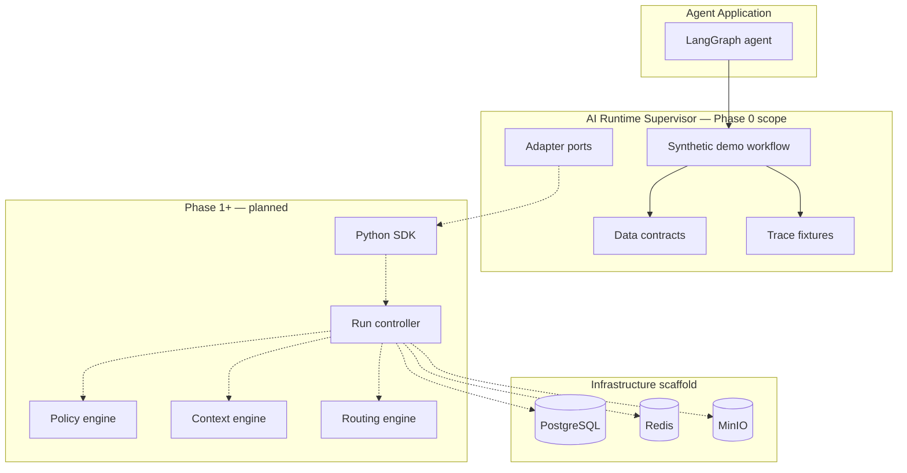

# Architecture

## Overview

The AI Runtime Supervisor is a **control plane** that sits between agent applications and model/tool providers. It does not replace agent frameworks, gateways, or observability platforms—it integrates with them.

## Phase 0 components

| Component | Path | Status |
|---|---|---|
| Task contract models | `src/supervisor/contracts/task.py` | Implemented (v0.1) |
| Run event models | `src/supervisor/contracts/events.py` | Implemented (v0.1) |
| Execution plan skeleton | `src/supervisor/contracts/plan.py` | Schema only |
| Policy definition skeleton | `src/supervisor/contracts/policy.py` | Schema only |
| Validation report | `src/supervisor/contracts/validation.py` | Implemented (v0.1) |
| LangGraph adapter port | `src/supervisor/adapters/langgraph/` | Interface + stub |
| LiteLLM mock adapter | `src/supervisor/adapters/litellm/mock.py` | Implemented |
| OTel export interface | `src/supervisor/telemetry/exporter.py` | Interface + no-op |
| Demo workflow | `examples/cited_market_research/` | Implemented |
| Trace fixtures | `fixtures/traces/` | Implemented |

## Data boundaries

- **Contracts are vendor-neutral.** Event and task schemas do not depend on LangGraph, LiteLLM, or any observability vendor.
- **Safe metadata by default.** Raw prompts and tool payloads are not persisted in fixtures; only previews and hashes.
- **Mock-first execution.** Demo and tests run without paid API credits unless explicitly opted in.

## Integration points (planned)

| Port | Phase | Purpose |
|---|---|---|
| LangGraph adapter | 1 | Capture framework lifecycle events |
| LiteLLM adapter | 1+ | Model access with pricing metadata |
| OTel exporter | 1 | Portable telemetry export |
| Postgres store | 1+ | Run metadata and audit |
| Redis counters | 2+ | Budgets and rate windows |

## Architecture rules

1. Keep public contracts independent of any gateway, framework, or observability vendor.
2. Implement integrations behind explicit adapter ports.
3. Feature-flag each policy, router, and enforcement action (Phase 2+).
4. Use safe metadata and redaction by default.
5. Begin all policies in observe mode.

## Related documents

- [Runtime chain](runtime-chain.md)
- [Data contracts](data-contracts.md)
- [Integrations](integrations.md)
- [ADRs](adr/)
