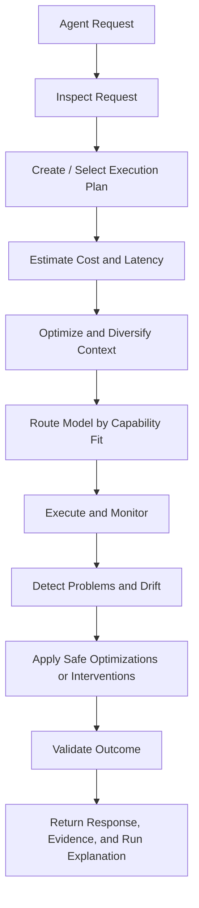

# Runtime Chain

The Supervisor implements work around this conceptual chain. Phase 0 establishes contracts and a synthetic workflow; later phases add behavior at each stage.

## Stage reference

| Stage | Phase 0 | Inputs | Outputs | Failure paths |
|---|---|---|---|---|
| Agent Request | Demo only | User query, task contract YAML | Initial agent state | Missing contract |
| Inspect Request | Implemented (Phase 3, advisory) | Task contract, request metadata | Intent classification | Unsupported task type |
| Create / Select Plan | Implemented (Phase 3) | Task contract | `ExecutionPlan` (tier options + steps) | — |
| Estimate Cost/Latency | Implemented (Phase 3, relative multipliers) | Plan, tier model | Tier options (Min/Balanced/High/Max) | Exceeds policy budget |
| Optimize Context | Implemented (Phase 3) | Master context, step role | Context manifest | Conflict detected |
| Route Model | Implemented (Phase 3) | Step capabilities, registry, tier | Routing decision + reason | No approved model |
| Detect Near-Duplicates / Cache | Implemented (Phase 4, opt-in) | Tool/model input + semantic key | `optimization.recommended` / `optimization.applied` | Cache miss / non-idempotent |
| Execute and Monitor | SDK + callbacks (Phase 1) | LangGraph graph, mock or live tools | `RunEvent` stream | Tool/model errors |
| Detect Problems | Observe mode (Phase 1) | Event stream | Policy triggers (`observe`) | — |
| Intervene | **Planned Phase 2** | Policy match | Intervention record | Unsafe to act |
| Validate Outcome | Demo validation | Brief artifact, task contract | `ValidationReport` | Checks fail |
| Return Result | Demo stdout | Report, events | JSON summary | Run failed |

## Phase 0 demo path

The cited market-research workflow exercises a subset of the chain:

1. Load task contract from YAML
2. Run LangGraph (instrumented via `LangGraphInstrumentedAdapter`): researcher → analyst → writer
3. Events captured automatically by the SDK/callback handler
4. Validate brief against quality checks (`validate_brief`)
5. Emit `validation.completed` and `run.completed` events

Embedded waste patterns (not blocked in Phase 0):

- **expensive scenario:** duplicate `search_competitors` call, retry storm on `fetch_source`
- **failed_validation scenario:** missing citations in synthesized brief

These patterns exist to support Phase 2 policy fixtures.

## Phase 1 detection (observe)

Phase 1 detects waste patterns from the event stream without changing execution:

- Duplicate tool calls via `normalized_input_hash` (only flags an equivalent *successful* prior call).
- Retry storms via `retry.attempt` against `RETRY_BUDGET` (default 5).
- Cost overruns via `total_cost_usd` vs `max_cost_usd`.
- Validation failures via `validation.completed`.

Each match emits a `policy.triggered` event with `policy_id`, `mode`, and `reason`. The recommended `intervention` field is advisory only—Phase 1 never acts.

## Phase 3 advisory planning (plan / context / routing)

Phase 3 is **advisory-only**, gated behind `SUPERVISOR_PLAN=1` (mirroring `SUPERVISOR_ENFORCE`). It annotates the event stream; it does not block or rewrite execution.

- `Supervisor.plan()` selects a `PlanTier` from the task contract (`select_tier`) and builds an `ExecutionPlan` with tier options and steps. The chosen tier is recorded on `run.started` as `tier`.
- `Supervisor.context(master_context=...)` builds a deterministic per-step `ContextManifest` (included / excluded / compressed slices + estimated tokens) via `ContextEngine` and emits `context.attached`.
- `Supervisor.route_model(capability=...)` resolves a model from `ModelRouter` using the planned tier, returning a `RoutingDecision`. Passing it to `Supervisor.model(routing=...)` records `routing_tier` / `routing_capability` / `routing_reason` on `model.requested`.
- `RunSummary` surfaces the plan tier (`plan_tier`) and every routed model call (`routing`).

See [ADR-008](adr/008-plan-tier-cost-model.md) and [ADR-009](adr/009-model-routing.md).

## Phase 4 adaptive optimization (semantic dedup + caching)

Phase 4 is **opt-in**, gated behind `SUPERVISOR_OPTIMIZE=1` with sub-mode
`SUPERVISOR_OPTIMIZE_MODE` (`dry_run` default, `active` to serve). It never changes
a business outcome unless explicitly activated.

- `Supervisor.tool(..., idempotent=True)` / `Supervisor.model(..., cacheable=True)`
  compute an exact key (`normalized_input_hash`) and a semantic key, then consult
  `DuplicateDetector`. A near-duplicate sets `match_type` / `similarity` on the
  `*.requested` event.
- **dry-run:** a cache hit emits `optimization.recommended` (estimated savings) but
  execution proceeds unchanged — observability only.
- **active:** an idempotent cache hit serves the prior result (`optimization.applied`,
  `cache_hit` on `*.completed`, cost recorded as 0) and skips re-execution.
- Caching is restricted to idempotent tools (`idempotent=False` default) and
  model calls (`cacheable=True`); write/unsafe tools are never cached. Phase 2
  policies still enforce on top.

See [ADR-010](adr/010-semantic-dedup-caching.md).

## Decision ledger

Generic traces do not capture full supervisor policy rationale. `policy.triggered` events (Phase 1) carry `policy_id`/`mode`/`reason`; a structured decision/intervention record extends normalized events in Phase 2.
