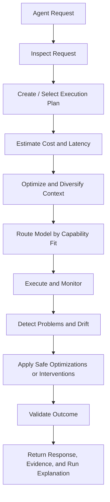

# Runtime Chain

The Supervisor implements work around this conceptual chain. Phase 0 establishes contracts and a synthetic workflow; later phases add behavior at each stage.

## Stage reference

| Stage | Phase 0 | Inputs | Outputs | Failure paths |
|---|---|---|---|---|
| Agent Request | Demo only | User query, task contract YAML | Initial agent state | Missing contract |
| Inspect Request | **Planned Phase 3** | Task contract, request metadata | Intent classification | Unsupported task type |
| Create / Select Plan | Schema only | Task contract | `ExecutionPlan` skeleton | — |
| Estimate Cost/Latency | **Planned Phase 3** | Plan, model pricing | Tier options (Min/Balanced/High/Max) | Exceeds policy budget |
| Optimize Context | **Planned Phase 3** | Master context, step role | Context manifest | Conflict detected |
| Route Model | **Planned Phase 3** | Step capabilities, registry | Routing decision + reason | No approved model |
| Execute and Monitor | Manual capture | LangGraph graph, mock tools | `RunEvent` stream | Tool/model errors |
| Detect Problems | **Planned Phase 2** | Event stream | Policy triggers (observe) | — |
| Intervene | **Planned Phase 2** | Policy match | Intervention record | Unsafe to act |
| Validate Outcome | Demo validation | Brief artifact, task contract | `ValidationReport` | Checks fail |
| Return Result | Demo stdout | Report, events | JSON summary | Run failed |

## Phase 0 demo path

The cited market-research workflow exercises a subset of the chain:

1. Load task contract from YAML
2. Run LangGraph: researcher → analyst → writer
3. Capture events manually via `TraceCapture`
4. Validate brief against quality checks
5. Emit `validation.completed` and `run.completed` events

Embedded waste patterns (not blocked in Phase 0):

- **expensive scenario:** duplicate `search_competitors` call, retry storm on `fetch_source`
- **failed_validation scenario:** missing citations in synthesized brief

These patterns exist to support Phase 2 policy fixtures.

## Decision ledger (Phase 1+)

Generic traces do not capture supervisor policy rationale. A separate decision/intervention record will extend normalized events in Phase 1.
